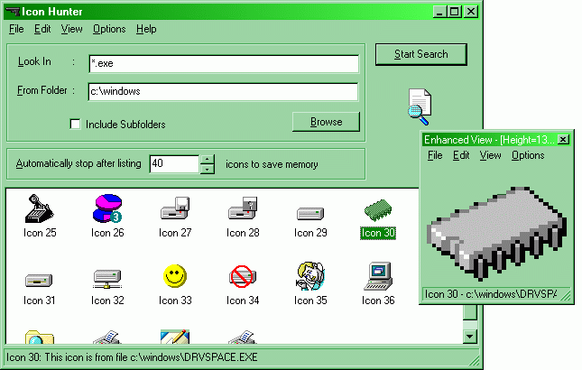



## Icon Hunter \- Icon Gallery 2 : Satisfy your icon thirst

### Description

IMPORTANT: YOU NEED ICON HUNTER FOR USING THESE ICON GALLERIES.KINDLY DOWNLOAD IT FIRST FROM PLANET-SOURCE-CODE.COM : -- : Hi Folks; This zip file contains a number of IGFs(Icon Gallery Files) under various categories, for using with my Icon Hunter. Do the following steps for using these icon galleries. 1] Download my Icon Hunter application from this site (make a search for "Icon Hunter" with out quotes to see it) if you haven't done so yet. 2] Extract all icon gallery files in this zip to a specific location. (eg: c:\my documents\icons) 3]Start Icon Hunter, type '*.*' in the 'Find In' box, and set the start up folder to the name of the folder you extracted the gallery files (eg: c:\my documents\icons). 4]Click the start button of Icon Hunter. 5]Vote for my Icon Hunter application :) :

Regards, Anoop M, anoopj12@angelfire.com:

Visit http://www.geocities.com/streamingaudio (if you r planning to invest in a new technology)
 
### More Info
 

             |
---                |---
**Submitted On**   |2000-05-28 13:07:42
**By**             |[Anoop Madhusudanan](https://github.com/Planet-Source-Code/PSCIndex/blob/master/ByAuthor/anoop-madhusudanan.md)
**Level**          |Intermediate
**User Rating**    |4.7 (14 globes from 3 users)
**Compatibility**  |VB 5\.0, VB 6\.0
**Category**       |[Complete Applications](https://github.com/Planet-Source-Code/PSCIndex/blob/master/ByCategory/complete-applications__1-27.md)
**World**          |[Visual Basic](https://github.com/Planet-Source-Code/PSCIndex/blob/master/ByWorld/visual-basic.md)
**Archive File**   |[CODE\_UPLOAD62445302000\.zip](https://github.com/Planet-Source-Code/anoop-madhusudanan-icon-hunter-icon-gallery-2-satisfy-your-icon-thirst__1-8474/archive/master.zip)

